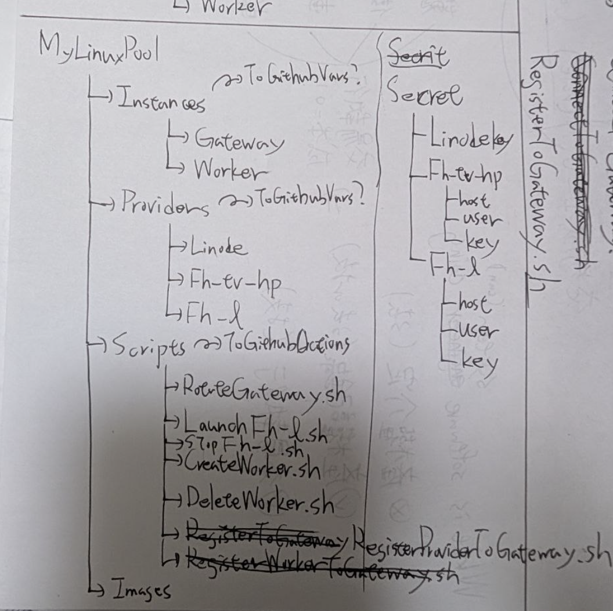

## 背景

我現在給我個人個人AI入口應用(手機APP)，加上了連接 Linux(透過 ssh), 執行指令，甚至掛監視器。

但我目前可選的 Linux 機器還很少，我需要透過這次建構我的 Linux Pool。
我目前機器架構如下

- GatewayNode
    -  Linode 上的 VPS, 整個架構中唯一擁有公開 IP 的節點
    - 擔當 Gateway
    - 其他節點用 ssh reverse tunnel 掛進來，但 port 不公開在 19x 的 if 上，只放在 127.0.0.1 介面卡上
- Fh-proxy
    - 我家裡常駐啟動的一台 Windows 筆電中的 WSL 系統
    - 家裡有其他裝置要在公網連接到時 都會透過他做 reverse proxy
    - 透過 ~/testSH/launchfhubuntuxxx 系列 wakeonlan 啟動我的主機(但現在不知道為啥好像壞了)
- Fh-l
    - 我的主力機，但因為很大 平常不啟動
    - 要啟動時基本透過 Fh-proxy 的 ~/testSH/launchfhxxx 系列 啟動 ubuntu 或 windows(但現在不知道為啥好像壞了)

※ 現在 Fh-proxy 跟 Fh-l 的 crontab 裡面都有土炮的開機就建立 ssh tunnel 的機制(會自檢 失敗重連)，但說實在現在好像壞了
※ 現在這個專案就是之前基於 fws.csie.io 為前提運用的自動 GatewayNode 的 Rotate 專案，但這次目的變化很多，我希望他管整個叢集

## 目的

我需要你幫我重新設計 / 實現這個專案

專案至少要讓我能容易地做以下事情

- Rotate Gateway: 重建/最新化 Gateway
- Launch Fh-l: 遠端啟動我的主力機
- Shutdown Fh-l: 遠端關機我的主力機
- Create worker: 開一個 container, 並把端口暴露到 Gateway 127.0.0.1 介面上(端口找有空的)
    - 指定 Fh-proxy, Fh-l 或其他存在的 provider 
    - 指定使用的 worker dockerfile

※ Gateway, Fh-proxy, Fh-l, Worker 各種實體的連接方式都要放在 github var 上(一台機器一個var)（其中 sshkey 就放在 github secret, github var 那邊對 secret 就指到 github secret 的 keyname 即可）
    - 連接方式可能要包含跳板指令陣列(ssh 模式) (不然我不知道如何吸收這個差異)
    - 要區分是 provider 還是純 worker

然後還要提供以下 script
- RegisterProvider: 跑下去就會直接裝一個東西，直接會把這台機器的 ssh port reverse mapping 到 Gateway 機器上
    - 給 Fh-proxy / Fh-l 用
    - 如果 GatewayNode Rotate, 東西也不用重新註冊，直接從 github 上抓需要的東西建立 tunnel
    - 機器重新開機連線還是會復活(類似現在 @reboot 寫的東西)

最後，當然要提供
1. Gateway 重建用機制(script 或 dockerfile 或其他?)(我是用 linode, 但不知道什麼方式最好 我不想額外花錢)
2. WorkerDockerfile 資料夾，裡面包含各種 dockerfile 能直接 build 直接當場用
3. 一些必要的預裝的東西。有兩個 1. 我的 rclone 認證, 2. 我的 browser profile(因為之後會讓 AI 在 docker 裡工作，沒 browser 啥都做不到, 參考 testAI/BrowserBase - 現在先不需要)
    - 當然這是現在 之後可能會擴張
    - 並且因為是敏感資料 所以希望一定要加密 密鑰可能就 openssl 生就好？ 需要時你再要求我生 publickey 跟 privatekey 丟 github secret 就好

我稍微整理一下架構 可能會長這樣?(非常初期的粗糙案 你可以改) - 

## 相關資訊

- GatewayNode
    - IP: 172.104.94.124
    - Username: fatesaikou
    - Key: (理論上現在 terminal 可以免密碼直接登入)
    - 備註: 我之前都是用 fws.csie.io 這個 ddns 去連線，但好像突然連不上了，新架構我打算把各主機連線資訊都擺到 github repo vars 裡面 (secret 擺 key?)
- Fh-proxy
    - IP:
        - 無公開 IP, 在 NAT 裡面，我基本上都用 google desktop fh-desktop 存取
            - 或者去到 GatewayNode 的 2226 port ssh 直接進 wsl
            - 現在這條路因為 fws.csie.io 無法解析 -> 我另外手動開一條手動的給你
    - Username: fatesaikou
    - Key: (理論上現在 terminal 可以免密碼直接登入, 注意 GatewayNode 上不能免密碼)
- Fh-l
    - IP:
        - 無公開 IP, 在 NAT 裡面，我基本上都用 GatewayNode 的 2222 port ssh 直接進 wsl(現在這條路因為 fws.csie.io 無法解析 不通)
        - 私有 IP 192.168.0.136

## 步驟

1. 理解我的需求與背景(/grill-with-docs)
2. 確認專案程式碼, 目前有的工具(包含 linode), 遠端機器的連通狀態與安裝工具(/opsx:explore)
3. 提案整體架構 運用方法 實現方針(基本設計) 不確定的東西一定要用 claudecode 的提問工具問 (/opsx:propose)
4. 清掃
    - repo: 清掉不需要的 repo 中的檔案
    - fh-proxy/fh-l: 刪除無效死亡的 script 與設定值
5. 建立 Provider 註冊用本體跟相關機制(先目標 fh-proxy(wsl2), fh-l)(含基本測一下)
6. 建立 Gateway rotate 用本體跟相關機制
    - 要包含 dlpw, uppw 兩個指令能通(因為我會用)
    - 包含重建機制啥的
7. 建立 Create worker 本體跟相關機制
    - 就先一個標準 Linux 環境

## 限制條件

- 每一步都需要經過我 review, 明確獲得我的 Ok 之前禁止往下推進
- 我建議你在團隊內擔當 PM, 負責進行以下
    - 需求釐清
    - 全體架構設計
    - 任務切分
    - 開發流程控制 / 實機執行驗收
    - (極力避免直接產出可執行程式碼，並且閱讀程式碼也只在限定範圍 有必要時才做, 還有涉及大量資料調研也都先用便宜模型看個大概)
- 你的團隊可以包含以下成員(全部都要用 herdr 做開啟，並且給足編輯/執行權限)
    - opencode ollama-cloud/deepseeek-v4.1-flash
    - opencode ollama-cloud/deepseeek-v4-flash:0731
    - agy gemini-3.8-flash high
    - (總之你根據需求調用)
